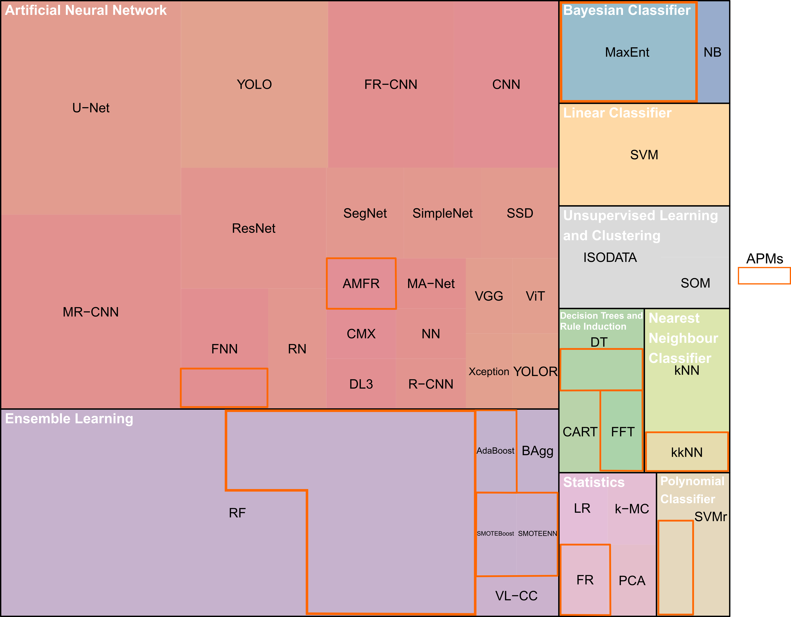
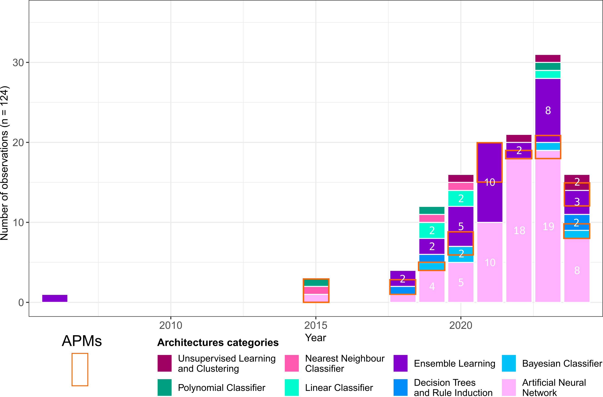

<!-- This is the format for text comments that will be ignored during renderings. Do not put R code in these comments because it will not be ignored. -->

<!-- With the following code you can access and display values from the yml header above. -->

<!--Keywords: `r rmarkdown::metadata$keywords`-->

Highlights: `r rmarkdown::metadata$highlights`

<!-- The actual document text starts here: -->

# Introduction

One of the central questions in archaeology lies in understanding the organisation of past societies [@renfrew_archaeology_2020; @trigger_settlement_1967], whether from an intra-site or inter-site perspective. Spatial organisation is a key driver of both present [@levi-strauss_contribution_1936] and past human interactions [@bonnichsen_millies_1973]. Consequently, the relationship between humans and space/place has been explored in depth by archaeologists since the mid-twentieth century [@chang_settlement_1968; @hodder_spatial_1976; @judge_predicting_1988; @kroll_interpretation_1991; @parsons_archaeological_1972; @phillips_method_1953; @willey_prehistoric_1953]. These studies have not only addressed relationships between humans but also human-environment interactions and interdependencies, emphasising the concept of resilience [@keck_what_2013]. The distribution of settlements and other perennial human structures has been a key indicator of these spatial dynamics within societies [@ellis_settlement_1999; @willey_prehistoric_1953]. To investigate such patterns, statistical approaches have been developed to assess spatial dependencies between settlements and environmental factors [@kvamme_one-sample_1990; @trigger_settlement_1967] or to detect distinctive site distributions that may reveal specific social behaviours [@hodder_spatial_1976; @judge_quantifying_1988; @kohler_predictive_1988; @kroll_interpretation_1991].

In parallel, the past decade has witnessed a "data deluge" in archaeology [@bevan_data_2015], evident across subfields such as GIS and remote sensing [@argyrou_review_2022; @davis_aerial_2020], text-based records [@brandsen_information_2023], and reflected also in the increasing frequency of machine learning applications in the field [@bellat_machine_2025]. This expansion has been particularly transformative in remote sensing, where airborne laser scanning (ALS or LiDAR) has produced high-resolution imagery capable of penetrating dense vegetation [@bennett_guidelines_2025], and the availability of diverse satellite datasets has greatly increased [@cracknell_development_2018]. Advances in automated detection and segmentation algorithms [@bonhage_modified_2021; @bundzel_semantic_2020; @guyot_combined_2021], improved GIS training for younger generations of archaeologists [@argyrou_review_2022], and the rise of open-science collaborations and networks [@batist_open_2024] have further accelerated this trend.

Although the idea of reducing survey results to binary classifications - "site" or "non-site" - dates back to @willey_prehistoric_1953, the real beginnings of predictive modelling in archaeology emerged in the 1970s and 1980s [@judge_predicting_1988; @thomas_empirical_1973], marking the rise of what has been termed "predictive archaeology" [@verhagen_integrating_2012, p.51]. This approach has been defined as an attempt to predict "*the location of archaeological sites or materials in a region, based either on a sample of that region or on fundamental notions concerning human behaviour*" [@kohler_predictive_1986], under the "*assumption that the location of archaeological remains in the landscape is not random, but is related to certain characteristics of the natural environment*" [@verhagen_case_2007, p.13]. If the definitions of "site" are often debated in archaeology [@mccoy_site_2020; @orton_covering_2000, pp.67-68], we conceived it here as an: "*anthropic perennial structure/installation*", with few exceptions [@benner_combining_2019; @carranza_study_2018; @perry_identifying_2018]. Although somewhat restrictive, this definition accurately represents the object studies in most of the analysed records. The term settlement pattern is understood following and adaptation of Willey’s definition [-@willey_prehistoric_1953, p.1], as: "*the way humans adapted themselves on the landscape on which they live*", to temper the original deterministic tone. With the development of GIS and enhanced computing capacity in the late 1980s [@allen_interpreting_1990; @djindjian_short_2015; @verhagen_case_2007, pp.15-16], a new generation of archaeological predictive models (henceforth APMs) emerged, designed to map site probabilities [@allen_predictive_1990; @altschul_models_1984; @kohler_predictive_1988; @kvamme_one-sample_1990; @moon_archaeological_1993]. These gave rise to two distinct approaches: inductive (data-driven) models and deductive (theory-driven) ones [@kamermans_predictive_1999; @wheatley_spatial_2013]. The former are constructed from observed variables, such as environmental or anthropogenic factors [@carrer_ethnoarchaeological_2013; @croce_ethnoarchaeological_2025; @ebert_state_2000; @yaworsky_advancing_2020], while the latter rely on expert-defined parameters [@canning_belief_2005]. Yet theory-driven models have remained underdeveloped, often criticised as overly simplistic or "unsophisticated" [@verhagen_integrating_2012]. They also bear strong affinities with agent-based modelling [@lake_explaining_2015], another computational approach in archaeology. The opposition between inductive and deductive methods, rooted in debates of the 1970s, is now increasingly regarded as outdated. Both insiders [@kvamme_there_2006; @verhagen_integrating_2012] and external commentators [@salmon_deductive_1976] view it as more of a historical and epistemological distinction than a current methodological divide.

Following the development of APMs, new approaches with automatic structure detection (henceforth ASD) emerged [@menze_detection_2006], supported by the spread of high-resolution satellite imagery, particularly digital elevation model (DEM) from the shuttle radar topographic mission (SRTM) in 2000 [@farr_shuttle_2007]. This innovative use of learning (henceforth ML) for the semi-automated detection of archaeological structures was aimed at tells, which are mounds formed from repeated human use, using SRTM data at a resolution of 90 m [@menze_detection_2006]. Despite the early use of ML for site detection, the more dramatic uptake of this method has only taken place since 2018 [@bellat_machine_2025], thanks to technological innovation and improvements in satellite imagery quality, combined with the increase in open-access satellite datasets such as Sentinel and Landsat [@zhu_benefits_2019]. Most archaeological structures are smaller than tells and require very-high-resolution satellite data (\< 1 m), in order to be detected. The decreasing cost of drones has also allowed them to be adopted by archaeologists for site documentation, which can generate *centimetre* and even *millimetre* resolution imagery. Along with all of the improvements in data availability and quality, ML methods saw significant advances in the late 2000s and 2010s, with the development of fast Graphics Processing Units (GPU's) which allowed for renewed interest and development in Deep Learning [@lecun_deep_2015] and Neural Networks aimed at analysing sparse data [@ronneberger_u-net_2015], which archaeological data usually is.

There have been criticisms of ASD, in the same way as how APMs were dismissed as lacking in theory. These criticisms are, however, enhanced for ML in archaeology due to the black box nature of many machine learning models, and concerns over accuracy and contextualisation of the results [@casana_regional-scale_2014; @opitz_recent_2018]. While these debates are important, and will lead to improvements in how ML for automatic structure detection is approached, binary questions such as whether a site is present or not in a location can lend themselves to automated approaches, especially when results are properly contextualised and interpreted by relevant experts. The original aim of @menze_detection_2006, to create: "*A comprehensive and accurate listing of these sites*", is still one of the goals of many applications of automatic structure detection. It is a non-destructive tool that allows for archaeological sites to be identified on a far larger scale than would be possible by fieldwork or manual survey of satellite imagery, while also increasing consistency and allowing for documentation of the entire process. It also allows for the detection of sites that have already been destroyed, through the use of historical imagery [@bulawka_deep_2024], the detection of sites in areas that are remote or difficult to access due to *e.g.* political instability [@rayne_detecting_2020], and country-wide detection of sites [@berganzo-besga_hybrid_2021].

Recent years have seen a rapid expansion of machine-learning applications in archaeology [@bellat_machine_2025; @bickler_machine_2021], driven in large part by the growing availability of large, heterogeneous datasets [@bevan_data_2015]. Archaeological predictive modelling and automated structure detection, while often treated as distinct methodological traditions, share a common theoretical background rooted in spatial analysis and assumptions about non-random patterning in the archaeological record. At the same time, both approaches are confronted with similar external pressures [@klehm_use_2023], including the need to manage growing data volumes and to integrate increasingly complex machine-learning techniques. In this context, it becomes timely to examine how these approaches, despite their shared conceptual foundations, adapted to the current challenges in archaeology [@huggett_is_2020; @moscati_how_2021], which are reshaping the discipline [@bellat_machine_2025].

Based on the above elements, this paper addresses the following research question: (1) What methodological trends have characterised archaeological predictive modelling and automated structure detection in recent development? (2)To what extent do these approaches converge in their use of machine-learning methods, and which methodological or conceptual features remain specific to each?

# Methodology

## Article selection

We conducted a rapid systematic review [@jesson_doing_2012] in accordance with the Preferred Reporting Items for Systematic Reviews and Meta-Analyses (PRISMA) guidelines [@page_prisma_2021]. This approach was chosen because it combines a relatively short scoping process along with methodological transparency [@haby_what_2016]. Our previous work [@bellat_machine_2025] served as the starting point for this review, to which we added records published in 2023 and 2024. To ensure consistency between the collected items we followed the exact same protocol as presented in @bellat_supplementary_2024 and @bellat_machine_2025. The protocol comprised queries derived from a set of archaeological and machine learning "keywords" ([Box 1](#box-01)), tested across six online databases: Web of Science, PubMed, Tübingen University Library, German Archaeological Institute, German National Library, and Google Scholar. These generalised databases ensured wide coverage of scientific publications without including overly specific grey literature records. Records published up to 2022 (*n* = 730) were taken from @bellat_supplementary_2024, while an additional 278 records were collected for 2023 and 2024, resulting in a total dataset of 1,006 records (@fig-flow).

The screening process followed two inclusion criteria [@dekkers_setting_2022, pp. 202-208]. First, only peer-reviewed records in academic journals were retained to ensure methodological consistency. Second, only English-language publications were included, also for consistency. Both criteria combined resulted in the exclusion of 213 records (@fig-flow). Following this first inclusion criteria, a retrieval based on the words within the article was performed. It was done within the *R* environment relying on the selection of keywords ([Box 1](#box-01)) included inside the abstract or title of the records as explained in detail in @bellat_machine_2025. In total from the newly collected data, 44 records were assessed as eligible, while 699 did not pass the retrieval process. From the @bellat_supplementary_2024 dataset, we only selected studies focusing on archaeological predictive modelling or automatic structure detection. For 2023 and 2024 papers, we read all abstracts and titles and manually selected publications that mentioned either of these two approaches.

We then applied two exclusion criteria [@dekkers_setting_2022, pp. 208-209] to refine the dataset. First, we restricted the sample to papers applying machine learning methods, excluding studies based solely on statistical approaches (*e.g.* regression-based methods, hard voting classifiers, and data transformation techniques), in line with related literature [@bzdok_statistics_2018; @bellat_machine_2025; @eleftheriadou_machine_2025]. While statistical methods focus on identifying relationships within datasets, machine learning aims to improve predictions for new data based on prior training [@alpaydin_introduction_2014]. Second, we excluded theory-based and review papers, as these do not provide an actual application of the ML methods.

In total, our review protocol yielded 84 included articles: 47 from @bellat_machine_2025 and 37 newly collected from 2023 and 2024.

::: {#box-01 .callout-tip collapse="false" title="Box 1: Search query used for the protocol search" appearance="minimal" icon="false"}
Topic = *machine learning \| deep learning \| artificial intelligence \| archaeological \| archeological \| archaeology \| archeology \| archaeo \| archeo*
:::

{#fig-flow fig-env="figure" fig-align="center"}

## Data collection {#sec-scraping}

From the reviewed records, we extracted 13 variables, both numerical and categorical ([Table 1](#tab-class)). The classification of model families followed @alpaydin_introduction_2014, and @bellat_machine_2025, and @eleftheriadou_machine_2025, while the evaluation methods were grouped into three categories: classification, regression, and clustering [@alpaydin_introduction_2014, pp. 5-13]. These “*Model*”, “*Best model*”, “*Family*”, and “*Evaluation*”, features serve as a basis for our latter reflection on new application of machine learning models of both ASD and APM approaches. The archaeological subfield of each study was assigned according to the framework established in previous work [@bellat_machine_2025; @kelly_archaeology_2017], this helped in distinguishing specific patterns of application for both approaches. Study outcomes were classified as successful, unsuccessful, mixed, or undefined, based on the authors' own assessment and goals; we also evaluated whether any article had important methodological issues. This feature also collected in @bellat_machine_2025 is not discussed in the later text but can be referred to as a qualitative assessment of the methodology used in a study.

::: {#tab-class}
|    **Feature**    | **Number of categories** |
|:-----------------:|:------------------------:|
|       Year        |            16            |
|       Model       |            36            |
|    Best model     |            13            |
|      Family       |            8             |
|     Subfield      |            5             |
|    Input data     |            4             |
|    Evaluation     |            3             |
|      Result       |            5             |
|   Pre-training    |            4             |
|Country of study area|            \-          |
|Size of the study area|            \-         |
| Size of structures|            5             |
| Data availability |            3             |
| Code availability |            2             |

Table 1: The fourteen features collected systematically from the review along with how many categories they were comprised of.
:::

Additional details were recorded for pre-training procedures and input data classes, which were also later integrated in the interpretation of the different methodological workflows and practices. We collected the country and the size of the study area - in case of several areas both were collected - and integrated it into our discussion as these features presented distinct patterns for both approaches. For the APM records, we also extracted the number of covariates used in the study and the type of feature selection executed, if any. This feature reflected methodological choice and difference between some studies. Furthermore, for the ASD study cases, the size of the structures detected was also collected. We extracted the type of performance metrics reported in each study, as well as their associated values (@fig-familybar). Since many publications did not provide complete performance metrics, we computed additional values where possible (*e.g.* from correlation matrices) to enable greater comparability across studies. Specifically, we calculated recall, precision, accuracy, and the F1-score ([Equations 1-4](#eq-01)), based on the true or false positives and negatives (TP, TN, FP and FN). In cases where multiple models or study areas were presented, only the highest reported score was retained. This choice was made to reflect the outcome of the model design by the researchers. Full definitions of all metric acronyms are provided in the glossary. Finally, we also recorded the availability of code and data from the screened records. These last two features, along with those mentioned above, can serve as a *catalogue* of datasets for future studies, including replication studies. Researchers can therefore enhance their own training data with additional data available in the list, compare their study with others sharing regional or size similarities, apply transfer learning from a previously trained model to their own data, and attempt the replication of publishes studies.

::::::: {#eq-01 .grid}
::: g-col-6
$$ (1)~Recall = \frac{TP}{TP + FP}$$
:::

::: g-col-6
$$(2)~Precision = \frac{TP}{TP + FN}$$
:::

::: g-col-6
$$(3)~Accuracy = \frac{TP + TN}{TP + TN + FP + FN}$$
:::

::: g-col-6
$$(4)~F1-score = 2\cdot\frac{recall \cdot precision}{recall + precision}$$
:::
:::::::

```{r script_prepare}
#| eval: false
#| echo: true
#| code-fold: true
#| code-summary: "Code for preparing the data"

# 00 Preparation ###############################################################

# 0.1 Folder check =============================================================
getwd()

# Clean up workspace
rm(list = ls(all.names = TRUE))

# 0.2 Load packages ============================================================
install.packages("pacman")
library(pacman) # Easier way of loading packages
pacman::p_load(dplyr, readr, stringr, tidyr, treemap, knitr, kableExtra, sf, rnaturalearth,
               ggplot2, readxl, patchwork, lubridate) # Specify required packages and download it if needed

# 0.3 Show session infos =======================================================
sessionInfo()

```

```{r script_prepare_hide}
#| echo: false
#| message: false
#| warning: false

library(dplyr)
library(readr)
library(stringr)
library(tidyr)
library(treemap)
library(knitr)
library(kableExtra)
library(sf)
library(rnaturalearth)
library(ggplot2)
library(readxl)
library(patchwork)
library(lubridate)
```

# Results

From the 84 records analysed, 15 addressed APM approaches and 69 focused on ASD techniques (@fig-yearpub). One study applied two distinct ASD methods, and another used two different APM approaches; these were therefore counted as separate study cases [@agapiou_detection_2021; @li_gis_2024]. A clear trend is visible from 2018 onwards, with at least one publication per year in each application area. This pattern intensified after 2020, with around 75% of all papers (*n* = 62) published in 2021 or later. The rapid growth of machine learning applications in archaeology since 2018, and particularly from 2020 and 2021, has also been noted by @bickler_machine_2021, @eleftheriadou_machine_2025 [Fig. 1], and in our previous work [@bellat_machine_2025, Fig. 2].

```{r figure_2_prepare}
#| echo: true
#| code-fold: true
#| code-summary: "Code for figure 2"

# 01 Figure 2, year of publication of the papers ###############################

# 1.1 Prepare the data =========================================================
asd <- read_excel("../data/raw_data/Statistics_papers.xlsx", sheet = "Final_results_ASD")
apm <- read_excel("../data/raw_data/Statistics_papers.xlsx", sheet = "Final_results_APMs")

# Remove Theory (Reason 1) and not ML (Reason 2) papers
asd <- asd[!asd$Results %in%  c("Reason 1", "Reason 2"), ]

# Remove the duplicate study case from Agapiou et al. 2021 and Li et al. 2024
asd.single <- asd[!asd$Name %in%  "Agapiou et al. 2021-2", ]
apm.single <- apm[!apm$Name %in%  "Li et al. 2024-2", ]

# 1.2 Format the data ==========================================
asd_table <- table(asd.single$Year)
apm_table <- table(apm.single$Year)

asd_df <- as.data.frame(asd_table)
apm_df <- as.data.frame(apm_table)

colnames(asd_df) <- c("year", "Freq")
colnames(apm_df) <- c("year", "Freq")

asd_df$year <- as.numeric(as.character(asd_df$year))
apm_df$year <- as.numeric(as.character(apm_df$year))

asd_df$type <- "ASD"
apm_df$type <- "APM"

combined_df <- rbind(asd_df, apm_df)

# Create a full sequence
all_years <- min(combined_df$year):max(combined_df$year)
complete_df <- data.frame(
  year = rep(all_years, 2),
  type = rep(c("ASD", "APM"), each = length(all_years))
)

# Join both df
df_final <- left_join(complete_df, combined_df, by = c("year", "type"))

# Remove NA by 0
df_final[is.na(df_final$Freq), "Freq"] <- 0

# Filter the APMs data before 2015
df_final_filtered <- df_final
df_final_filtered[df_final_filtered$type == "APM" & df_final_filtered$year < 2015, "Freq"] <- NA

# 1.3 Create the plot ==========================================================
plot <- ggplot(df_final_filtered, aes(x = year, y = Freq, color = type)) +
  geom_rect(xmin = 2021, xmax = 2024, ymin = -Inf, ymax = Inf,
            fill = "lightblue", alpha = 0.03, inherit.aes = FALSE) +
  coord_cartesian(xlim = c(min(df_final$year), max(df_final$year) + 1),
                  ylim = c(0, 30)) +
  geom_line(data = subset(df_final_filtered, type == "ASD"),  linewidth = 1.5) +
  geom_line(data = subset(df_final_filtered, type == "APM"),  linewidth = 0.75) +
  geom_point(data = subset(df_final_filtered, type == "ASD" & Freq > 0),
             shape = 21, color = "#69b3a2", fill = "white", size = 4.5, stroke = 1) +
  geom_point(data = subset(df_final_filtered, type == "APM" & Freq > 0),
             shape = 19, color = "#ff7f0e", size = 3) +
  geom_text(aes(label = ifelse(Freq > 0 & type == "ASD" &
                                 year != 2024, round(Freq, 2), "")),
            vjust = -1.2, hjust = 1, color = "black") +
  geom_text(aes(label = ifelse(Freq > 0 & type == "ASD" & year == 2024, round(Freq, 2), "")),
            vjust = -0.95, hjust = -0.2, color = "black") +
  geom_text(aes(label = ifelse(Freq > 0 & type == "APM" & year != 2015, round(Freq, 2), "")),
            vjust = 1.75, hjust = 0, color = "black") +
  geom_text(aes(label = ifelse(Freq > 0 & type == "APM" & year == 2015, round(Freq, 2), "")),
            vjust = -0.95, hjust = 1, color = "black") +
  labs(x = "Years",
       y = paste0("Number of publications (ASD: n = ", sum(asd_df$Freq),
                  ", APM: n = ", sum(apm_df$Freq), ")"),
       color = "Type") +
  scale_x_continuous(breaks = seq(min(df_final$year), max(df_final$year), by = 2)) +
  scale_color_manual(values = c("ASD" = "#69b3a2", "APM" = "#ff7f0e")) +
  theme_classic() +
  theme(legend.position = "top")

```

```{r figure_2_plot}
#| echo: false
#| label: fig-yearpub
#| message: false
#| warning: false
#| fig-cap: "Number of publications per year between 2006 and 2024, split between ASDs and APMs (*n* = 84). In light blue, the articles published after 2021 accounted for more than 75% of the publications. Figure generated with *R 4.5.0*."
#| fig-align: center
#| 
plot(plot)
```

Regarding the type of algorithms used, deep learning methods and artificial neural networks (ANNs) are the most represented, with 65 uses (@fig-treemap), followed by ensemble learning models (*n* = 33), in particular, random forest (RF), which is the most prominent model with 28 applications. All other families of machine learning models, Bayesian classifiers, linear classifiers, unsupervised learning and clustering, decision trees and rule induction, nearest neighbour classifiers and polynomial classifiers, are more or less, equally represented (@fig-treemap). The rise of ANNs can be seen from 2020 and 2021 onwards (see supplementary file) and follow the general trend of all reviewed publications (@fig-yearpub). There is a high diversity of models used, with 39 different algorithms but only half of them were used more than once. This number could have also been affected by the level of granularity we used for the classification of the methods, as no inter-rater reliability analyses were performed due to expediency. Furthermore, we counted two applications of statistical methods, used in parallel of other machine learning models, one linear regression [@fuentes-carbajal_machine_2023] and one k-means clustering [@ben-romdhane_detecting_2023].

```{r figure_3_prepare}
#| eval: false
#| echo: true
#| code-fold: true
#| code-summary: "Code for figure 3"


# 02 Figure 3, tree map ########################################################

# 2.1 Import the data ==========================================================
df <- read_excel("./analysis/data/raw_data/Statistics_papers.xlsx", sheet = "Models statistics")
df <- df[-109,-c(6:10)]
df <- df[df[3] !=0,] # Remove models with no occurences

# 2.2 Format the data ==========================================================
df_counted <- df[,c(1:5)]
names(df_counted) <- c("description", "model", "value", "value.best", "family")
df_counted$family[df_counted$family == "N/A"] <- "Statistics"

# 2.2 Create and export the graph  =============================================
png("./analysis/figures/Fig.3/Fig.3_raw.png", width = 1200, height = 1000)
pdf("./analysis/figures/Fig.3/Fig.3_raw.pdf", width = 12, height = 10)
par(mar = c(0, 0, 0, 0))
tm <- treemap(df_counted,
              index = c("family", "model"),
              vSize = "value",
              type = "index",
              fontsize.labels = c(16, 15),  # Masquer les labels de famille
              fontcolor.labels = c("white", "black"),  # Noir sur Pastel1
              bg.labels = 0,
              align.labels = list(c("left", "top"), c("center", "center")),
              title = "",
              palette = "Pastel1",
              border.col = c("black", "white"),
              border.lwds = c(2, 0))
dev.off()
```

{#fig-treemap fig-env="figure" fig-align="center"}

From the collected performance metrics, we identified 20 unique measures (@fig-metrics), though only nine appeared in more than one study. In total twelve records of ASD application did not present any evaluation measurement, while this was the case in five for the APMs. Among ASD applications, recall, precision, and F1-score were reported in 65% of cases (*n* = 45), with accuracy additionally included in 25 of these. Intersection over Union (IoU) was used in nine studies, mainly in segmentation tasks. For APMs, 66% (*n* = 8) reported Area Under the Curve (AUC), while only four relied soly on alternative metrics.

```{r figure_4_prepare}
#| echo: true
#| eval: false
#| code-fold: true
#| code-summary: "Code for figure 4"

# 4 Figure 4, family per year of publication ###################################
# 4.1 Prepare the data =========================================================
apm_long <- apm %>%
  separate_rows(Family, sep = ";")

asd_long <- asd %>%
  separate_rows(Family, sep = ";")

combined <- rbind(apm_long[,c(3,6)], asd_long[,c(3,6)])
table <- table(combined)
freq_df <- as.data.frame(table)
colnames(freq_df) <- c("year", "family", "Freq")

# Remove absence of data
freq_df <- freq_df[freq_df$Freq > 0,]
freq_df <- freq_df[freq_df$family != "N/A",]

# Convert the date to number
freq_df$year <- as.numeric(as.character(freq_df$year))

# 4.2 Prepare the plot =========================================================

# Blindfold colors
color <- c('#9F0162', '#009F81', '#FF5AAF', '#00FCCF', '#8400CD', '#008DF9', '#00C2F9', '#FFB2FD')

freq_df <- freq_df %>%
  arrange(year, family) %>%
  mutate(
    cumsum_freq = ave(Freq, year, FUN = cumsum),
    pos = cumsum_freq - 0.5 * Freq)

# print(freq_df)

# 4.3 The plot =================================================================
plot<- ggplot(freq_df, aes(x = year, y = Freq, fill = reorder(family, -as.numeric(family)))) +
  geom_bar(stat = "identity", colour = "white", width = 0.9) +
  geom_text(aes(y = pos, label = ifelse(Freq > 1, Freq, "")),
            color = "white",
            size = 4) +
  scale_fill_manual(values = color,
                    labels = c(
                      "Unsupervised Learning and Clustering"  = "Unsupervised Learning \nand Clustering",
                      "Nearest Neighbour Classifier"  = "Nearest Neighbour \nClassifier",
                      "Artificial Neural Network"  = "Artificial Neural \nNetwork",
                      "Decision Trees and Rule Induction" = "Decision Trees \nand Rule Induction")
  )+
  labs(
    x = "Year",
    y = paste0("Number of observations (n = ", sum(freq_df$Freq), ")"),
    fill = "Architectures \ncategories"
  ) +
  coord_cartesian(xlim = c(2006, 2024), ylim = c(0, 36)) +
  theme_bw() +
  theme(
    legend.position = "bottom",
    legend.box = "vertical",
    legend.margin = margin(),
    legend.text = element_text(size = 9),
    legend.title = element_text(size = 11, face = "bold"),
    axis.text.y = element_text(size = 11),
    axis.title.y = element_text(size = 11, face = "bold"),
    axis.text.x = element_text(size = 11),
    axis.title.x = element_text(size = 11, face = "bold"))

# Plot
plot

ggsave("./analysis/figures/Fig.4/Fig.4_raw.png", plot = plot, width = 9, height = 6, units = "in", dpi = 600)
ggsave("./analysis/figures/Fig.4/Fig.4_raw.pdf", plot = plot, width = 9, height = 6, units = "in")

```


{#fig-familybar fig-env="figure" fig-align="center"}

We also examined model performance scores by plotting precision against recall for ASD models, including F1-score and accuracy when available (@fig-scatter). The median F1-score was 0.76, while the median accuracy reached 0.86. Precision tended to be slightly higher (median = 0.86) than recall (median = 0.74). However, a subset of studies reported very low precision, which reduced the mean values of both precision and recall to 0.74.

```{r figure_5_prepare}
#| echo: true
#| eval: false
#| code-fold: true
#| code-summary: "Code for figure 5"

# 05 Figure 5, results and metrics #############################################

# 5.1 Import the data ==========================================================
metrics <- read_excel(".analysis/data/raw_data/Statistics_papers.xlsx", sheet = "Metrics_full")

# 5.2 Prepare the data =========================================================
metrics <- as.data.frame(metrics)
metrics_df <- data.frame(
  eval_metrics = character(),
  study_id    = character(),
  score       = numeric(),
  type        = character(),
  stringsAsFactors = FALSE
)
metrics_df[1,] <- c("","",0,"")

for (i in 1:nrow(metrics)) {
  metric <- metrics[i,c(5:23)]
  metric <- metric[, colSums(is.na(metric)) == 0, drop = FALSE]
  metric <- round(metric, digit = 2)
  if (ncol(metric) == 0) {
    NA
  } else if (ncol(metric) == 1) {
    x <- as.data.frame(c(colnames(metric), metrics[i, 2], metric, metrics[i, 4]))
    colnames(x) <- colnames(metrics_df)
    metrics_df <- rbind(metrics_df, x)
  } else {
    for (j in 1:ncol(metric)) {
      x <- c(colnames(metric[j]), metrics[i, 2], metric[,j], metrics[i, 4])
      metrics_df <- rbind(metrics_df, x)
    }
  }
}

metrics_df <- metrics_df[-1,]

# 5.3 Prepare the plot =========================================================
metric_counts <- table(metrics_df$eval_metric)
sorted_metrics <- names(sort(metric_counts, decreasing = FALSE))

study_counts <- table(metrics_df$study_id)
sorted_studies <- names(sort(study_counts, decreasing = TRUE))

metrics_df$present <- 1

all_combinations <- expand.grid(
    eval_metrics = sorted_metrics,
    study_id = sorted_studies,
    stringsAsFactors = FALSE)


plot_data <- merge(all_combinations, metrics_df,
                     by = c("eval_metrics", "study_id"), all.x = TRUE)

plot_data$present[is.na(plot_data$present)] <- 0

study_counts_df <- data.frame(
    study_id = names(study_counts),
    metric_count = as.numeric(study_counts))

plot_data <- merge(plot_data, study_counts_df, by = "study_id")

plot_data <- plot_data %>%
  select(-type) %>%
  left_join(metrics %>% select(Name, Task) %>% distinct(),
            by = c("study_id" = "Name"))

plot_data$eval_metrics <- factor(plot_data$eval_metrics, levels = sorted_metrics)
plot_data$study_id <- factor(plot_data$study_id, levels = sorted_studies)
plot_data<- plot_data[order(plot_data$metric_count, decreasing = TRUE), ]


# 5.4 Create the plot ==========================================================
plot <- ggplot(plot_data, aes(x = study_id, y = eval_metrics))+
    geom_tile(aes(fill = ifelse(present == 1, metric_count, NA)),
              color = "gray", size = 0.3) +
  geom_text(aes(
    label = ifelse(
      present == 1 & !is.na(score) & metric_count <= 3,
      score, "")),
    color = "black", size = 2, fontface = "bold") +
  geom_text(aes(
    label = ifelse(
      present == 1 & !is.na(score) & metric_count > 3,
      score, "")),
    color = "white", size = 2, fontface = "bold") +
    scale_fill_gradient(low = "#DEEBF7", high = "#08519C",
                        name = "Metric\nCount",
                        na.value = "transparent",
                        breaks = c(2, 3, 4, 5, 6),
                        labels = c("2", "3", "4", "5", "6+")) +
    labs(
      x = "Case Studies",
      y = "Evaluation Metrics"
    ) +
    theme_minimal() +
    theme(
      axis.text.x = element_text(angle = 45, hjust = 1, size = 6),
      axis.text.y = element_text(size = 6),
      legend.title = element_text(size = 8),
      legend.text = element_text(size = 8),
      axis.title.x = element_text(size = 8),
      axis.title.y = element_text(size = 8),
      panel.grid = element_blank()
)
```

![Number of metrics and metrics scores presented in the reviewed papers (*n* = 69). Some papers did not present any metrics. The different metrics are represented on the left, and the case study citation note is at the bottom. The blue gradient indicates the number of metrics used for one case study, with a minimum of 1 (pale blue) and a maximum of 6 (strong blue). APM papers are highlighted by an orange rectangle. Figure generated with *R 4.5.0* and modified with *Inkscape*, inspired by @eleftheriadou_machine_2025.](../figures/Fig.5/Fig.5.png){#fig-metrics fig-env="figure" fig-align="center"}

```{r figure_6_prepare_hide}
#| echo: false
#| message: false
#| warning: false

metrics <- read_excel("../data/raw_data/Statistics_papers.xlsx", sheet = "Metrics_full")

# 5.2 Prepare the data =========================================================
metrics <- as.data.frame(metrics)

```

```{r figure_6_prepare}
#| echo: true
#| code-fold: true
#| code-summary: "Code for figure 6"

# 06 Figure 5, scatterplot  ####################################################

# 6.1 Prepare the data =========================================================

scatter_df <- metrics[metrics$Task == "Automatic Structure Detection",]
scatter_df <- scatter_df[!is.na(scatter_df$`F1 Score`),]
scatter_df$ID <- gsub("ID0", "", scatter_df$ID)
scatter_df$ID <- gsub("ID", "", scatter_df$ID)

# 6.2 Plot the data ============================================================

plot <- ggplot(scatter_df , aes(x = Recall, y = Precision, label = ID)) +
  geom_point(aes(size = `F1 Score`, color = Accuracy)) +
  geom_text(size = 2.5, vjust = -2, hjust = 1) +
  scale_size_continuous(range = c(3, 8)) +
  scale_color_viridis_c(option = "viridis", end = 0.99) +
  xlim(0, 1) + ylim(0, 1) +
  labs(
    x = "Recall",
    y = "Precision",
    color = "Accuracy",
    size  = "F1-score"
  ) +
  theme_minimal()
```

```{r figure_6_plot}
#| echo: false
#| label: fig-scatter
#| message: false
#| warning: false
#| fig-cap: "Scatter plot of the recall and precision scores for the ASD records (*n* = 45), numbered according to the ID number of the study in our table. F1-score is represented by the area of the point, and accuracy is shown with a gradient colour when available. Figure generated with *R 4.5.0* and modified with *Inkscape*."
#| fig-align: center

plot(plot)
```

The spatial distribution of study areas indicates a broadly global coverage, although notable regional disparities remain (@fig-map). While case studies are represented across most continents, Africa, and Central Asia, appear in comparison underrepresented. Conversely, regions that have traditionally received less attention in archaeology, such as Oceania, are well represented through studies conducted in American Sāmoa, the Republic of the Marshall Islands, and Australia [@quintus_evaluating_2023; @karamitrou_identification_2023]. Southwestern Asia and South America also account for a substantial number of case studies, particularly in Iraq [@altabrawee_predicting_2019; @altaweel_automated_2022; @menze_detection_2006; @soroush_deep_2020] and Peru [@payntar_multi-temporal_2023; @sakai_accelerating_2023; @zimmer-dauphinee_eyes_2024]. Despite this broad geographic distribution, a clear imbalance remains between hemispheres. The Northern hemisphere concentrates approximately 84% of the recorded studies (@fig-map), reflecting a continued dominance in research production. At the national scale, China, Iraq, the United States and Peru lead in the number of applications of ASD and APM approaches, with eight, seven and six case studies respectively.

```{r figure_7_prepare}
#| echo: true
#| warning: false
#| error: false
#| code-fold: true
#| code-summary: "Code for figure 7"

# 07 Figure 7, Country of the study area #######################################

# 7.1 Prepare the data  ========================================================
col_name <- names(apm)[19]
apm_long <- apm %>%
  separate_rows(col_name, sep = ";")

asd_long <- asd %>%
  separate_rows(col_name, sep = ";")

combined <- rbind(apm_long[,19], asd_long[,21])
table <- table(combined)
freq_df <- as.data.frame(table)
colnames(freq_df) <- c("name", "value")

world <- ne_countries(scale = "medium", returnclass = "sf")

# 7.2 Formate the names  =======================================================

replace <- c("USA" = "United States of America",
             "American Sāmoa" = "American Samoa",
             "Maurice" = "Mauritius",
             "Republic of the Marshall Islands" = "Marshall Is.")

freq_df  <- freq_df  %>%
  mutate(name = recode(name, !!!replace))

freq_df$name[freq_df$name == ""] <- NA

freq_df <- na.omit(freq_df)

map_data <- world %>%
  left_join(freq_df, by = "name")

plot <- ggplot(map_data) +
  geom_sf(aes(fill = value)) +
  labs(fill = "Number of \nstudies") +
  scale_fill_gradient(
    low = "#deebf7",
    high = "#08306b",
    na.value = "grey95"
  ) +
  coord_sf(crs = "+proj=robin") +
  theme_minimal() +
  theme(axis.text.x = element_blank())

```

```{r figure_7_plot}
#| echo: false
#| label: fig-map
#| message: false
#| warning: false
#| fig-cap: "Map of the countries where the studies were conducted (*n* = 115). Figure generated with *R 4.5.0*."
#| fig-align: center

plot(plot)
```

We also considered the size of the studied areas ([Figure 8A](#fig-sizes)) and, for ASD records only, the size of the detected structures ([Figure 8B](#fig-sizes)). The smallest areas of interest (AOIs) corresponded to fields as small as 25 m$²$ [@agapiou_machine-learning-assisted_2024], whereas the largest AOIs in APM studies cover entire continents, such as the model developed by @walker_predicting_2023, of approximately 8,000,000 km$²$. Overall, the size of APM study areas tended to be substantially larger, with a median of 6,305 km$²$, compared to ASD AOIs, which had a median of 475.50 km$²$. Focusing specifically on automatic structure detection, the size of the detected structures is mostly concentrated between 5 m and 200 m, representing about 80% of all structures ([Figure 8B](#fig-sizes)). Structures at the layer or site level each account for approximately 8% of the corpus.

```{r figure_8_prepare}
#| echo: true
#| warning: false
#| error: false
#| code-fold: true
#| code-summary: "Code for figure 8"

# 08 Figure 8, Surface of the AOI and structure ################################

# 8.1 Prepare the data for the first figure ====================================

col_name <- names(apm)[21]
apm_long <- apm %>%
  separate_rows(col_name, sep = ";")
apm_long$type <- "apm"

asd_long <- asd %>%
  separate_rows(col_name, sep = ";")
asd_long$type <- "asd"

combined <- rbind(apm_long[,c(21,24)], asd_long[,c(23,27)])

combined[[1]] <- str_replace_all(combined[[1]],
                              pattern = c("\\~"="", " "="", ","="", "km2"=""))


text_clean1 <- str_replace_all(apm_long[[21]],
                              pattern = c("\\~"="", " "="", ","="", "km2"=""))
text_clean1 <- na.omit(as.numeric(text_clean1))

text_clean2 <- str_replace_all(asd_long[[23]],
                               pattern = c("\\~"="", " "="", ","="", "km2"=""))
text_clean2 <- na.omit(as.numeric(text_clean2))

df <- data.frame(combined)
df <- na.omit(df)
df[[1]] <- as.numeric(df[[1]])

df <- df %>%
  mutate(pct = 1 / nrow(df))

colnames(df) <- c("size_num", "type", "pct")

# 8.2 First figure plot ========================================================

gg1 <- ggplot(df, aes(x = size_num, weight = pct, fill = type)) +
  geom_density(position = "stack", color = "NA", alpha = 0.6) +
  scale_x_continuous(trans='log10') +
  scale_fill_manual(values = c("apm" = "#440154",
                                 "asd" = "#31688e")) +
  labs(
    x = "Size of the study (log scale km²)",
    y = "Proportion of studies") +
  theme_minimal() +
  theme(legend.position="none",
        panel.grid.minor.x = element_blank(),
        panel.grid.minor.y = element_blank()) +
  annotate("text", x = 0, y = 0.42, label = "A", fontface = "bold", size = 9, hjust = -0.2, vjust = 0.5) +
  annotate("text", x = 200, y = 0.25, label = "APMs", size = 5, hjust = -0.2, vjust = 0.5) +
  annotate("text", x = 10, y = 0.05, label = "ASDs", size = 5, hjust = -0.2, vjust = 0.5)

# 8.3 Prepare the data for the second figure ===================================

col_name <- names(asd)[24]
asd_long <- asd %>%
  separate_rows(col_name, sep = ", ")

size_num <- as.factor(na.omit(asd_long[[24]]))
size_num <- factor(size_num, levels=c('Layer level (< 5 m)', 'Small (5 > 50 m)', 'Medium (50 > 200 m)',
                                      'Large (200 > 500 m)', 'Site level (> 500m)'))
df <- as.data.frame(size_num)

# 8.4 Second figure plot =======================================================

gg2 <- ggplot(df, aes(x = size_num, fill = size_num)) +
  geom_bar() +
  labs(
    x = "",
    y = "Number of studies") +
  scale_fill_viridis_d() +
  theme_classic() +
  scale_y_continuous(limits = c(0, NA), expand = expansion(mult = c(0, 0.05))) +
  theme(legend.position="none",
        axis.line.x =element_blank(),
        axis.ticks.x=element_blank()) +
  annotate("text", x = 0.5, y = 40, label = "B", fontface = "bold", size = 9, hjust = -0.2, vjust = 0.5) +
  theme(axis.text.x = element_text(angle = 45, vjust = 0.9, hjust =1))

# 8.5 Combined figure ==========================================================

plot <- gg1|gg2
```

```{r figure_8_plot}
#| echo: false
#| label: fig-sizes
#| message: false
#| warning: false
#| fig-cap: "**A**: Density plot of the area of interest size - transformed in log10 - for both APMs and ASDs records (*n* = 91). **B**: Bar plot of the size of structures of the ASDs records (*n* = 104). Figure generated with *R 4.5.0*."
#| fig-align: center

plot(plot)
```

# Discussion

## Common elements

From a theoretical perspective, both archaeological predictive models and archaeological structure detection share a common conceptual background. At their core lies the notion of site probability [@gillies_human-centred_2016; @hodder_spatial_1976; @willey_prehistoric_1953], rooted in the fundamental archaeological question of why "populations located sites where they did" [@kvamme_analysing_2020, p. 213]. Both approaches address this question by attempting to predict site locations. Judge and Lynne defined prediction as "*the ability to foretell on the basis of observation, experience, or scientific reason*" [@judge_quantifying_1988, p. 2]. This predictive dimension was explicitly present in the early stages of APMs [@verhagen_integrating_2012], and is even reflected in their name, but it is less immediately visible in the terminology of ASD. Nevertheless, one of the earliest works to apply predictive modelling for archaeological structure detection in remote sensing imagery - @menze_detection_2006 on Syrian tells - explicitly framed the task as the need for "*a comprehensive and accurate listing of these sites*" effectively operationalising presence/absence prediction in a way analogous to APMs.

Another key similarity between APMs and ASDs lies in their reliance on remote sensing data, whether derived from UAVs [*e.g.* @monna_machine_2020; @orengo_brave_2019; @sakai_ai-accelerated_2024] , aircraft [*e.g.* @bonhage_modified_2021; @guyot_combined_2021; @lidberg_detection_2024], or satellites [*e.g.* @caspari_convolutional_2019; @castiello_explorative_2021; @karamitrou_identification_2023]. The rise of both applications is closely tied to the broader expansion of remote sensing in archaeology [@argyrou_review_2022], itself driven by the rapid increase in Earth observation satellites since 2015 (@fig-remote). This growth has also been fuelled by greater accessibility to satellite and LiDAR datasets, as well as by major improvements in image resolution, particularly from modern airborne laser scanning (ALS) platforms (0.5 - 1 m resolution) and UAVs. Future developments in remote sensing are likely to further enhance archaeological applications, not only through sensor advances but also through computational methods such as super-resolution techniques [@liu_remote_2025; @wang_comprehensive_2022].

```{r figure_9_prepare}
#| echo: true
#| warning: false
#| error: false
#| code-fold: true
#| code-summary: "Code for figure 9"

# 09 Figure 9, Remote sensing publication ######################################

# 9.1 Prepare the data for dimension ===========================================

# For the Dimension website (visited on the 20/08/2025)
# Inclusion criteria "remote sensing" keyword; 43 (History, Heritage and Archaeology) category
# Years 2000 to 2024

number <- c(176,192,188,181,205,213,246,322,345,375,431,
            585,770,854,926,850,1109,1092,1204,1180,1480,1597,1758,1804,1949)
years <- seq(2000, 2024, by = 1)
df_dimension <- data.frame(year = years, Freq = number)

# 9.2 Prepare the data for web of science ======================================
# For the Web of Science website (visited on the 20/08/2025)
# Inclusion criteria "remote sensing" keyword; Arcaheology Web of Science category
# Years 2000 to 2024

number <- c(6,4,2,5,2,9,10,14,13,32,18,61,22,22,25,21,61,64,147,243,88,73,128,753,78)
years <- seq(2000, 2024, by = 1)
df_web <- data.frame(year = years, Freq = number)

# 9.3 Prepare the data for UCS Satellite Database ==============================
# Visited on the 20/08/2025 at https://test.ucsaction.org/resources/satellite-database
sat <- read_excel("../data/raw_data/UCS-Satellite-Database 5-1-2023.xlsx")

# Select only satellites for earh observation non military
sat <- sat[sat$Purpose == "Earth Observation",]
sat <- sat[sat$Users != "Military",]
number <- sat$`Date of Launch`
number <- na.omit(number)
number <- as.numeric(number)
number <-  as.Date(number, origin = "1899-12-30")
year <- year(number)

# Select only satellites lunched after 2000
year <- year[year > 1999]
df_sat <- as.data.frame(table(year))
df_sat$year <- as.character(df_sat$year)
df_sat$year <- as.numeric(df_sat$year)

# 9.4 Plot the data ============================================================

plot1 <- ggplot(df_dimension, aes(x = year, y = Freq)) +
  coord_cartesian(xlim = c(min(years), max(years) + 1),
                  ylim = c(0, 2000)) +
  geom_line(color = "#69b3a2", linewidth = 1) +
  geom_point(shape = 19, color = "#69b3a2", size = 3) +
  annotate("text", x = 2000, y = 2000, label = "A", fontface = "bold", size = 11, hjust = 0.5, vjust = 1.1) +
  labs(y = "Number of records in Dimension",
       x = "Year") +
  theme_minimal() +
  theme(panel.grid.major.x = element_blank(),
        panel.grid.minor.x = element_blank())

plot2 <- ggplot(df_web, aes(x = year, y = Freq)) +
  coord_cartesian(xlim = c(min(years), max(years) + 1),
                  ylim = c(0, 800)) +
  annotate("text", x = 2000, y = 800, label = "B", fontface = "bold", size = 11, hjust = 0.5, vjust = 1.1) +
  geom_line(color = "#69b3a2", linewidth = 1) +
  geom_point(shape = 19, color = "#69b3a2", size = 3) +
  labs(y = "Number of records Web of Science",
       x = "Year") +
  theme_minimal() +
  theme(panel.grid.major.x = element_blank(),
        panel.grid.minor.x = element_blank())

plot3 <- ggplot(df_sat, aes(x = year, y = Freq)) +
  coord_cartesian(xlim = c(min(years), max(years) + 1),
                  ylim = c(0, 150)) +
  annotate("text", x = 2000, y = 150, label = "C", fontface = "bold", size = 11, hjust = 0.5, vjust = 1.3) +
  geom_line(color = "#69b3a2", linewidth = 1) +
  geom_point(shape = 19, color = "#69b3a2", size = 3) +
  labs(y = "Number of earth observation satellites \nlunched (UCS Satellite Database)",
       x = "Year") +
  theme_minimal() +
  theme(panel.grid.major.x = element_blank(),
        panel.grid.minor.x = element_blank())

plot <- (plot1 | plot2) / plot3
```

```{r figure_9_plot}
#| echo: false
#| label: fig-remote
#| message: false
#| warning: false
#| fig-cap: "**A**: Number of records in the archaeological field mentioning remote sensing in the Dimension database. **B**: Number of records in the archaeological field mentioning remote sensing in the Web of Science database. **C**: Number of satellites dedicated to earth observation launched per year, according to the USC database, we did not take military satellites into account. Figure generated with *R 4.5.0*."
#| fig-align: center

plot(plot)
```

Despite differences in the types of models employed in APMs and ASDs, both fields show a strong reliance on the RF algorithm. In ASD tasks, RF accounts for nearly 20% of applications (*n* = 18), while in APMs it represents 41% (*n* = 10). The prominence of RF in archaeological machine learning is unsurprising: the method is relatively straightforward to implement and can be applied flexibly to both classification and prediction problems [@breiman_random_2001].

Another common theme is the broadly worldwide representation of both APMs and ASD study cases (@fig-map). Concerning these trends, the underrepresentation of African case studies likely reflects the only recent development of archaeological research in the continent [@davis_aerial_2020]. Limited access to funding and lack of large-scale remote sensing datasets are likely to also contribute to this imbalance. In the post-Soviet sphere, lower representation might come from a historical tendency toward relative scientific isolation within Russia and some affiliated countries. Between 1993 and 2017, Russia accounted for only approximately 0.33% of global publication in humanities, on average [@gilyarevskii_dynamics_2019, Table 3]. This structural separation from mainstream international research networks has probably intensified following the Russian aggressions against Ukraine from 2014 and 2022 onwards, further limiting scientific collaboration and visibility [@jack_russian_2024]. Conversely, the comparatively high representation of ASD applications in Iraq and Peru may be explained by favourable environmental and archaeological conditions. Large parts of Iraq and neighbouring regions of the Arabian Peninsula are characterised by relatively flat topography and sparse vegetation cover, conditions that enhance the performance of satellite-based remote sensing [@casana_global-scale_2020]. In addition, characteristic settlement forms such as tells - artificial mounds formed by long-term occupation - are particularly well suited to aerial and satellite detection methods [@menze_detection_2006], though the centuries-old interest in the region for its well-renowned history and archaeology is undoubtedly a contributing factor. Comparable environmental advantages are also found in parts of coastal and arid Peru, where low vegetation density and clear surface visibility support remote sensing approaches [@sakai_accelerating_2023; @sakai_ai-accelerated_2024; @zimmer-dauphinee_eyes_2024].

## Differences in approaches

While APMs and ASDs share several similarities, important differences explain why they have followed distinct research trajectories. From a theoretical standpoint, APMs benefit from a more established background built over more than 40 years of practice [@judge_predicting_1988; @kvamme_analysing_2020]. They have also faced criticism, particularly for their perceived deterministic nature [@kamermans_deconstructing_2004; @kvamme_there_2006], reflecting their strong roots in ecological science [@yaworsky_neanderthal_2024]. By contrast, ASDs have been less subject to such criticism, as they are more data-driven and object-focused. Their main limitations concern their ability to connect with broader archaeological questions and engage a wider audience [@davis_object-based_2019; @davis_defining_2020; @davis_theoretical_2021]. However, the past five years have seen growing interest in ASDs [@bennett_guidelines_2025]. The OpenAI to Z Challenge is one example of bridging a niche method with public engagement, aiming to locate archaeological sites in the Amazon using large language models and computer vision tools with OpenAI o3/o4 mini and GPT-4.1 (<https://openai.com/openai-to-z-challenge>).

Differences are also evident in the use of machine learning methods. ASD studies frequently employ artificial neural networks (ANNs; *n* = 57), particularly U-Net [*e.g.* @anttiroiko_detecting_2023; @bundzel_semantic_2020; @garcia-molsosa_potential_2021], convolutional neural networks [CNNs @gallwey_bringing_2019; @ikaheimo_detecting_2023; @soroush_deep_2020], and their region-based or mask-based variants [*e.g.* @bonhage_modified_2021; @quintus_evaluating_2023; @verschoof-van_der_vaart_learning_2019]. In contrast, our review found only two APM studies using ANNs [@oonk_supervised_2015; @wang_archaeological_2023]. Bayesian classifiers also show divergent use: MaxEnt appears exclusively in APMs [*e.g.* @benner_combining_2019; @imen_utilizing_2024; @wang_archaeological_2023], given its suitability for handling pseudo-absence data [@yaworsky_advancing_2020].

Another major difference lies in the input data. ASD typically relies on single-image datasets [LiDAR, UAV, or satellite imagery, @altaweel_automated_2022; @guyot_combined_2021]. This choice is partly due to the finer resolution of such imagery (\< 10 m), suited to detecting small structures, and partly to the suitability of deep learning models for image recognition. By contrast, APMs often integrate multiband datasets - including DEMs, spectral information, and soil chemistry - with more than ten covariates commonly included [@oonk_supervised_2015; @castiello_explorative_2021]. The number of covariates is less limited as the process does not need recognition, but prediction based on pixel values. Feature selection, a method to reduce of the number of input data variables (@fig-apm), is often applied to simplify the model and increase transposability, either through expert-driven choices [@friggens_predicting_2021; @hansen_prioritizing_2020] or statistical methods [@oonk_supervised_2015; @wang_archaeological_2023; @yaworsky_advancing_2020].

```{r figure_10_prepare}
#| echo: true
#| code-fold: true
#| warning: false
#| error: false
#| code-summary: "Code for figure 10"

# 10 Figure 10, covariates selection ############################################

# 10.1 Prepare the data =========================================================

cov <- data.frame(name = apm$Name, nb.cov = apm$`Nb. Cov.`, cov.sel = apm$`Cov. Selec.`)
cov <- na.omit(cov)
cov$cov.sel <- c(8,2,8,21,10,25,6,27,65,8,16,16,7,12)
cov$cov.type <- c("PCA", NA, NA,"Human", "PCA", NA, "Human", NA,
              NA, "VIF/auto-correl", NA, NA, NA, NA)
cov_long <- cov %>%
  pivot_longer(cols = c("nb.cov", "cov.sel"),
               names_to = "metric",
               values_to = "value") %>%
  mutate(metric = case_when(
    metric == "nb.cov" ~ "Nb Coverage",
    metric == "cov.sel" ~ "Coverage Selected",
    TRUE ~ metric
  ))


# 10.2 Plot the data ============================================================

plot <- ggplot(cov, aes(x = name)) +
  geom_col(aes(y = nb.cov),
           fill = "lightpink", width = 0.8) +
  geom_col(aes(y = cov.sel, fill = cov.type),
           width = 0.8) +
  labs(
    y = "Number of covariates",
    x = "",
    fill = "Covariates selection \ntype (if any)") +
  theme_minimal() +
  theme(
    axis.text.x = element_text(angle = 45, hjust = 1),
    legend.position = "bottom",
    panel.grid.major.x = element_blank(),
    panel.grid.minor.x = element_blank()
  ) +
  scale_fill_brewer(type = "qual", palette = "Pastel2")
```

```{r figure_10_plot}
#| echo: false
#| label: fig-apm
#| message: false
#| warning: false
#| fig-cap: "Number of covariates used in the APMs papers reviewed and the type of feature selection selected (*n* = 14). Figure generated with *R 4.5.0*."
#| fig-align: center

plot(plot)
```

Interpretability also differs markedly. ASD, especially when based on deep learning, is often considered a "black box" because the contribution of individual features is unclear [@bickler_machine_2021]. Recent progress in explainable AI (XAI) has improved transparency, for example, through saliency maps that highlight which areas of an image drive predictions [@barredo_arrieta_explainable_2020; @xu_explainable_2019 but see @rudin_stop_2019]. However, XAI remains relatively uncommon in ASD. In contrast, APMs naturally lend themselves to interpretation, as the influence of each covariate can be quantified and visualised [@li_gis_2024].

When examining the size of the AOIs, another difference was a broader spatial extent observed in APM studies ([Figure 8A](#fig-sizes)). It can largely be explained by the environmental scope and conceptual framework underlying these models [@kvamme_analysing_2020]. Predictive modelling aims to capture landscape-scale patterns, which requires accounting for spatially dispersed and sometimes distant environmental variables. Moreover, APMs frequently rely on survey datasets or institutional records [@castiello_explorative_2021; @imen_utilizing_2024; @miera_large-scale_2022], which typically cover extensive geographic regions. In contrast, automatic structure detection applications tend to provide detailed analyses of localized phenomena. These studies are often constrained to relatively small regions [@guyot_detecting_2018; @trier_using_2018; @sakai_accelerating_2023] or rely on high-resolution UAV imagery covering individual fields or restricted surfaces [@monna_machine_2020; @orengo_brave_2019].

Regarding the size of the detected structures in ASD records, the predominance of features ranging between 5 m and 200 m ([Figure 8B](#fig-sizes)) reflects the primary archaeological targets of these studies. Most applications focus on domestic structures [@bundzel_semantic_2020; @zimmer-dauphinee_eyes_2024], individual constructions [@gallwey_bringing_2019; @davis_locating_2021], or funerary features [@guyot_detecting_2018; @trier_using_2018]. Only a limited proportion of studies address large-scale fortifications [@canedo_automated_2024; @stott_searching_2019], collective architectural complexes [@soroush_deep_2020], or entire archaeological sites [@garcia-molsosa_potential_2021; @menze_detection_2006; @orengo_automated_2020]. On the other hand, APM approaches only focus on site-scale prediction and detection.

Finally, APMs generally follow a well-established and relatively lightweight workflow requiring limited computational resources, reflecting their long-standing use in archaeology. By contrast, ASD research is less standardised, employing a wide range of models and metrics (@fig-treemap; @fig-metrics; @fig-scatter). This diversity is unsurprising given its recent and rapidly evolving development, combined with the variety of models used. Over time, ASD workflows may become more structured as the field matures. However, they remain computationally demanding, requiring substantial time and resources despite the accessibility of cloud platforms such as *Google Colab*.

## Limitation of the study

Several limitations of our study should be acknowledged. First, our screening strategy (see @sec-scraping) involved the review of some articles by a single author, while records from @bellat_machine_2025 were reviewed by two authors. This element might have introduced subjectivity when assessing certain objective criteria (*e.g.* subfield classification), although the collected items largely consist of fixed categories ([Table 1](#tab-class)). Our strategy also excluded non-peer-reviewed publications and non-English language records. Inclusion of diverse sources, such as book chapters or conference proceedings, might have altered some results. However, trends observed in non-peer-reviewed materials - as observed by the authors of this publication - were largely consistent with those reported here. Additionally, our decision to report only the highest evaluation scores prevents comparisons across the full range of scores where various models were applied but only the best performing reported, which could have otherwise provided a more nuanced assessment of model performance. Due to concerns about reproducibility and inter-rater reliability, we therefore relied on a single metric per record. Interpretation of archaeological research questions based on model results was consistently guided by the best-performing model.

Regarding the corpus itself, the diversity of regions and periods explored introduces further limitations in comparing models. As noted above, some global regions remain underrepresented, primarily due to research biases linked to funding and economic constraints [@allik_factors_2020]. While the country of the primary affiliation of the first authors of the reviewed publications may be skewed towards wealthier countries [see @bellat_machine_2025], this bias appears less pronounced at the level of research areas (@fig-map). Open access to data and code remains a critical issue: only 31% of records provided full or partial access to data, or shared their original code, or both ([Table 2](#tab-availability)). Replicability is a fundamental principle of science [@popper_logic_2005] and has been highlighted as crucial for archaeology by @marwick_open_2017, @marwick_is_2025 and @queffelec_replication_2026. The lack of accessible data or code thus represents a notable limitation of the corpus. Finally, other biases may affect interpretation, including publication bias favoring positive results [@song_publication_2013] and the FUTON effect privileging open-access publications [@wentz_visibility_2002]. Beside code and data the lack of transparency was also presents in the results, 1/3 of the ASD record did not presented metrics results (@fig-metrics). Similar observation were made by @eleftheriadou_machine_2025 were they had to look in figures and graphs in detail for evaluation results, which should have been explicitly presented in the text.

```{r table_2_prepare}
#| echo: true
#| eval: false
#| code-fold: true
#| warning: false
#| error: false
#| code-summary: "Code for table 2"

# 11 Table for the data/code-access ############################################

# 11.1 Table for data ==========================================================
data_table <- rbind(asd.single[,c(2,25)], apm.single[,c(2,22)])
data_df <- as.data.frame(data_table)

data_df <- data_df[data_df[2] != "No",]

colnames(data_df) <- c("name", "Availability")
table_data <- data_df %>%
  group_by(Availability) %>%
  summarise(
    Number = n(),
    References = paste(name, collapse = "; "),
    .groups = "drop"
  )

# 11.2 Table for code ==========================================================
data_table <- rbind(asd.single[,c(2,26)], apm.single[,c(2,23)])
data_df <- as.data.frame(data_table)

data_df <- data_df[data_df[2] == TRUE,]

colnames(data_df) <- c("name", "Availability")
table_code <- data_df %>%
  group_by(Availability) %>%
  summarise(
    Number = n(),
    References = paste(name, collapse = "; "),
    .groups = "drop"
  )

table_final <- rbind(table_data, table_code)
table_final <- as.data.frame(table_final)
```

::: {#tab-availability tbl-colwidths="[20,15,65]"}
| **Availability** | **No. of articles** | **References** |
|:------------------|:------------------------:|:--------------------------:|
| Data fully available | 10 | @anttiroiko_detecting_2023; @bachagha_use_2023; @karamitrou_identification_2023; @oonk_supervised_2015; @orengo_automated_2020; @perry_identifying_2018; @stott_searching_2019; @trotter_machine_2022; @verschoof-van_der_vaart_learning_2019; @yaworsky_advancing_2020 |
| Data partially available (API or platform) | 16 | Altaweel et al. [-@altaweel_automated_2022; -@altaweel_monitoring_2024]; @bulawka_deep_2024; @carter_when_2021; @casini_humanai_2023; @davis_deep_2021; @fisher_multidisciplinary_2022; @ikaheimo_detecting_2023; @li_gis_2024; @lidberg_detection_2024; @miera_large-scale_2022; @quintus_evaluating_2023; @rayne_detecting_2023; @sobotkova_validating_2024; @walker_predicting_2023; @zimmer-dauphinee_eyes_2024 |
| Code available | 26 | @agapiou_detection_2021; Altaweel et al. [-@altaweel_automated_2022; -@altaweel_monitoring_2024]; @berganzo-besga_hybrid_2021;  @bulawka_deep_2024; @carter_when_2021; @casini_humanai_2023; @davis_deep_2021; @fiorucci_deep_2022; @fisher_multidisciplinary_2022; @gallwey_bringing_2019; @ikaheimo_detecting_2023; @li_gis_2024; @lidberg_detection_2024;  @liu_discovering_2023; @orengo_brave_2019; @orengo_automated_2020; @perry_identifying_2018; @quintus_evaluating_2023; @rayne_detecting_2023; @sobotkova_validating_2024; @stott_searching_2019; @trotter_machine_2022; @walker_predicting_2023; @yaworsky_advancing_2020; @zimmer-dauphinee_eyes_2024 |

Table 2: Available material and code from the reviewed studies (*n* = 84).
:::

# Conclusion

This review has examined recent developments and trends of the use of machine learning in two different approaches in archaeology: archaeological structure detection (ASD) and archaeological predictive models (APMs). Our survey, based on a reproducible methodology, covers studies published from the mid-2000s to 2024. As in other subfields of AI in archaeology, ASD has attracted growing interest since 2020, while APM has not yet fully embraced the AI transition, with relatively few studies adopting such methods.

The dominance of artificial neural networks in ASD reflects the suitability of deep learning for image recognition. Convolutional neural networks, and particularly MR-CNNs, have proven highly effective for detecting archaeological features and are now widely used. By contrast, APMs continue to rely on more established approaches, such as Bayesian classifiers (*e.g.*, MaxEnt) and ensemble learning with random forest. Progress in explainable AI is argued by to be able to improve the interpretability of deep learning, which could particularly benefit ASD applications [@labba_iarch_2023]. However, this positivist vision of AI progress is not shared by all [@gattiglia_managing_2025; @tenzer_debating_2024].

Another critical point concerns the perspective of both approaches within the development of machine learning techniques and "big data" in general. As established in the introduction, the "inductive vs. deductive" distinction is probably a matter of the past, but questions remain regarding how this new area of computational approaches is transforming archaeology. The current opposition lies between theory-driven and data-driven approaches [@huggett_is_2020], and whether big data could: "*abolish models, theories, and hypotheses*" [@gattiglia_think_2015]. While some technology pundits might be tempted to advocate for a data revolution - as expressed in Clive Humby’s 2006 statement "*Data is the new oil*" [@farronato_data_2025] - or for an AI-driven one [@suleyman_how_2023], this remains far from certain. Both practices will undoubtedly change methodologies, processes, and the quantity or type of data analysed. However, the fundamental archaeological question remains unchanged: "is there an archaeological site at this location?". From this perspective, theory has not evolved despite technological breakthroughs, and archaeologists remain in control of the theoretical and modelling process - as they must, in an analytical perspective [@bellat_machine_2025; @chanteau_archeologie_2013; @orton_mathematics_1980, p.5].

Our comparison has highlighted both theoretical and methodological differences ([Table 3](#tab-conclusion)). APMs build on a long-standing research tradition and tend to employ more standardised workflows, while ASD remains less structured and more experimental. The diversity of input data also distinguishes the two approaches: APMs integrate multiple covariates (*e.g.*, digital elevation models, spectral data, climate variables), providing a broader picture of past landscapes, whereas ASD focuses mainly on single-band imagery (LiDAR, aerial or satellite data). ASD tasks also demand greater computational resources in terms of time and processing power.

::: {#tab-conclusion}
| **Element** | **Archaeological predictive models** | **Automatic structure detection** |
|:------------------|:------------------------:|:--------------------------:|
| Theoretical background and foundations | Strong, with developed literature | Limited, growing community and common practices but recent |
| Access to the input data | High, worldwide covering on open-access platforms | Reduce access to input data, depending of national policies |
| Number of input data | Exhaustive, all possible landscape features | Often limited to a single type of image source (monochrome or RGB) |
| Pre-treatment | Mixed, feature selection and sampling selection can occur | Limited, data augmentation in a few cases |
| Model complexity | Low. Ensemble learning and Bayesian classifier models | High. Neural network models with millions of parameters |
| Time needed | Low. Limited time needed for local and regional-based model | High. Large amount of time needed for deep learning computation model. |
| Cost | Low cost | Low to high cost in case of high compute power needed for model training needing GPU capacities |
| Model interpretability | High, with each feature's influence on the model | Low, with neural network models acting as "black boxes" |
| Metrics | Few of the metrics available | Numerous metrics available depending on the segmentation task |
| Result interpretability | Limited. Prediction maps and binary maps can be computed when needed | Easy to read results |
| Adaptability | Limited to a type of landscape | Limited to the type of structure studied |

Table 3: Summary of various aspects of ASD and APM approaches.
:::

From this review, several future directions can be identified:

1.  The availability of larger datasets will encourage further applications in APMs. For ASD, given that imaging resolution has already reached near-critical levels, the most promising developments lie in open-access data, FAIR principles, and shared databases [@casillo_artificial_2025].

2.  More standardised and collaborative workflows, supported by platforms such as GitHub or Google Colab [@batist_open_2024], will enhance reproducibility and strengthen the scientific foundations of both approaches [@marwick_is_2025].

3.  ASD offers a clear binary outcome, "site or not". APMs provide probabilistic predictions, yet remain limited by the challenge of defining true absence data [@kamermans_deconstructing_2004; @mcdonald_site-based_2015].

4.  Commercial applications are also likely to diverge. ASD is increasingly applied in practice, with dedicated workflows such as the ADAF model [@coz_earthobservationadaf_2024; @coz_advancing_2025]. By contrast, APMs have long sought but rarely secured a consistent role in cultural heritage management [@deeben_beyond_1997; @espa_gis_2006], due to both methodological challenges and administrative constraints [@kamermans_predictive_1999; @kamermans_smashing_2008; @verhagen_case_2007].

Finally, both ASD and APM will inevitably need to address broader concerns surrounding the ethical use and development of artificial intelligence [@tenzer_debating_2024]. As these methods mature, balancing technological innovation with responsible practice will remain a central challenge for the future of AI in archaeology.

[**Author contributions:**]{.underline} M.B. and A.H., conceived the idea for the manuscript and initiated and designed the research. M.B., A.H. and J.D.O.F., collected data and selected the articles. M.B. and A.H., performed the statistical analysis and interpreted the results. M.B., A.H. and J.D.O.F., wrote the manuscript, with critical input from all co-authors. M.B., A.H. and J.D.O.F., reviewed the manuscript.

[**Acknowledgements:**]{.underline} We would like to thank the organizers of the CAA2025 Session 46: *Advances in Computational Archaeology*, L. Fischer and J. Glover, as well as the three reviewers who provided many comments that greatly helped in improving the manuscript.

[**Fundings:**]{.underline} This work has received funding from the Deutsche Forshungemeischaft (DFG) Collaborative Research Center (CRC) 1070 "ResourceCultures", grant agreement n°215859406.

[**Conflict of interest statement:**]{.underline} The authors declare no conflict of interest.

[**Data availability statement:**]{.underline} The data used in this study are openly available on the Zenodo repository at <https://doi.org/10.5281/zenodo.18882443>.

[**Declaration of Generative AI and AI-assisted technologies in the writing process:**]{.underline} During the preparation of this work, the authors used ChatGPT 4.5 [@brown_language_2020] in order to generate part of the R code and improve spelling and diction in already-written text. After using this tool, the authors reviewed and edited the content as needed and take full responsibility for the content of the publication.

# Annexes

```{r annexes}
#| echo: true
#| warning: false
#| error: false
#| code-fold: true
#| code-summary: "Code for annexe table"

df <- read_excel("../data/raw_data/Statistics_papers.xlsx", sheet = "Models statistics")
df <- df[-nrow(df),-c(6:10)]
df <- df[df[3] !=0,] # Remove models with no occurrences

# 1.2 Format the data ==========================================================
df_counted <- df[,c(1:5)]
names(df_counted) <- c("description", "model", "value", "value.best", "family")
df_counted$family[df_counted$family == "N/A"] <- "Statistics" 

df_counted$approach <- "Machine learning"
df_counted$approach[df_counted$family == "Statistics"] <- "Statistics"
df_counted$family[df_counted$model == "FR"] <- "Probability"
df_counted$family[df_counted$model == "LR"] <- "Linear Regression"
df_counted$family[df_counted$model == "k-MC" | df_counted$model == "PCA" ] <- "Dimensionality Reduction"

df_counted <- select(df_counted, approach, family, description, model, value, value.best)
df_counted <- df_counted %>%  arrange(approach, family, desc(value))

df_counted %>%
  kable("pipe", caption = "List of algorithms used in the papers under review organized by the approach and family of method they were classified into, along with their abbreviations, and number of applications. In the case the model was compared to others, we highlighted the number of times it was selected as the best model.", col.names = c("Approach", "Family", "Description", "Model abreviation", "Number of uses",
                                                     "Number of time the model performed the best")) %>%
  kable_styling(full_width = FALSE) %>%
  collapse_rows(columns = c(1,2), valign = "top")

```

# References

<!-- The following line ensures the references appear here for the MS Word or HTML output files, rather than right at the end of the document (this will not work for PDF files):  -->

::: {#refs}
:::

## Colophon

This report was generated on `r Sys.time()` using the following computational environment and dependencies:

```{r}
#| label: colophon
#| cache: false

# which R packages and versions?
if ("devtools" %in% installed.packages()) devtools::session_info()
```

The current Git commit details are:

```{r}
# what commit is this file at? 
if ("git2r" %in% installed.packages() & git2r::in_repository(path = ".")) git2r::repository(here::here())  
```
